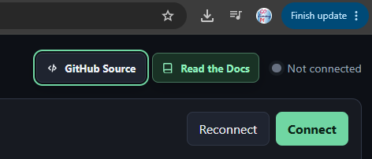

Troubleshooting
===============

.. _webusb-access-denied:

WebUSB flasher reports ``USBDevice.open(): Access denied``
----------------------------------------------------------

If the FPGA web flasher can see the ULX3S FTDI device but Windows rejects
``USBDevice.open()``, the problem occurs before JTAG begins. Direct WebUSB
access requires the ULX3S FT231X interface to use the WinUSB driver rather than
the normal FTDI VCP/D2XX driver.

#. Close ``fujprog``, OpenOCD, ``openFPGALoader``, and other programs that may own the FT231X.
#. Confirm that the selected device is the ULX3S ``US1`` FT231X.
#. Bind that interface to WinUSB, for example with Zadig.
#. Unplug and reconnect ``US1``.
#. Reload the web application and reconnect the flasher.

.. warning::

   Replacing the FTDI driver changes how Windows exposes that interface.
   Verify the selected device before changing its driver. Software that expects
   the normal FTDI VCP/D2XX driver will not use that interface until the FTDI
   driver is restored.

.. figure:: images/Zadig-FTDI-to-WinUSB.png
   :alt: Zadig replacing the ULX3S FTDI driver with WinUSB.
   :width: 580px

   Example ULX3S FT231X WinUSB selection.

See :doc:`user-guide/web-flasher` for the complete WebUSB programming flow
and driver restore notes.

WebUSB flasher reports an unrecognized JTAG ID
----------------------------------------------

Do not program until the physical ECP5 target is identified. Close other JTAG
software, unplug/reconnect ``US1``, reconnect the browser, and probe again. A
healthy ULX3S probe should identify a supported ECP5 such as ``LFE5U-12F`` or
``LFE5U-85F`` and display its 32-bit IDCODE.

The FT231X USB product string is not authoritative for the FPGA variant. Use
the ECP5 JTAG ID reported by **Probe JTAG** when deciding whether an image
matches the board.

WebUSB flasher reports an FPGA image target mismatch
-----------------------------------------------------

This is a safety check. The ECP5 target embedded in the selected ``.bit`` file
does not match the physical JTAG ID. Select or rebuild the bitstream for the
attached FPGA instead of bypassing the check.

.. _web-serial-no-compatible-devices:

Web Serial picker says no compatible devices found
---------------------------------------------------

If the browser opens the Web Serial chooser but reports ``No compatible
devices found`` even though Windows shows the COM port, check the browser
before changing hardware or USB serial drivers.

#. If Chrome shows ``Finish update``, ``Relaunch``, or another pending-update
   indicator, complete the update and fully restart Chrome. During
   Hazard3-Doom testing, Chrome still enumerated a CH340 adapter as ``COM7``
   in ``chrome://device-log`` while the Web Serial chooser remained empty.
   After the update was completed and Chrome was relaunched, the chooser
   worked again.
#. Retry **Connect**. The Hazard3-Doom web console intentionally requests the
   browser's serial-port picker without a USB VID/PID filter, so it is designed
   to work with any serial port the browser exposes.
#. Close PuTTY, upload scripts, IDE serial monitors, or other programs that may
   already own the port.
#. Open ``chrome://device-log``, enable the Serial and USB categories, and
   inspect whether the expected COM port was removed but never added again.
   During one verified debug session, Chrome logged ``Serial device removed:
   path=COM7`` and did not recover after OpenOCD was merely stopped, even though
   PuTTY could still open the port. Physically unplugging and reconnecting the
   external USB-UART adapter forced Windows/Chrome re-enumeration and restored
   the Web Serial chooser.
#. If debug activity preceded the failure, close PuTTY and other serial owners,
   stop OpenOCD, then physically disconnect/reconnect **the external USB-UART
   adapter**. Stopping OpenOCD alone may release its FT231X/JTAG handle without
   causing Chrome to rediscover the independent COM port.
#. After reconnecting, ``chrome://device-log`` should show both the USB device
   and a fresh ``Serial device added`` event for the expected COM port. Use
   **Connect** in the web UI to invoke the browser chooser.
#. Do not use ``navigator.serial.getPorts()`` as a complete Windows COM-port
   inventory. It returns only ports already authorized for the current browser
   origin. Use **Connect** to grant access to another port.

   If the Web Serial chooser is empty while Chrome shows a pending update,
   complete the update and relaunch before changing serial drivers.

Doom upload times out
---------------------

* Exit Doom with ``Ctrl-X`` so the resident monitor is listening.
* Close PuTTY or any other program that owns the UART port.
* Confirm the selected COM/TTY device.
* Confirm that the monitor and uploader use the same memory profile.

SD card mounts but files are not found
--------------------------------------

* Use root filenames ``DOOM.H3D`` and ``DOOM.WAD``.
* Confirm FAT16/FAT32 formatting.
* Use the monitor ``c`` command to inspect FAT type, mount state, and discovered file sizes.
* Avoid relying on long filenames; the boot path is designed around root 8.3 names.

SD becomes unreliable when ESP32 firmware runs
----------------------------------------------

Confirm that ESP32 GPIO 14, 15, 2, and 13 are high-impedance while Hazard3 owns the SD bus. A firmware ownership flag is insufficient if the ESP32 pin drivers remain enabled.

SAO scan finds some devices but not others
------------------------------------------

Not every SAO is necessarily an I2C peripheral. Some devices may use the optional GPIO pins or unusual I2C behavior. Use ``sao info``, ``sao scan``, ``sao probe``, and device-specific documentation before assuming the bridge is faulty.

``i2c gui`` is reported as an unknown command
-----------------------------------------------

The board is running an older resident monitor. Building a new ELF does not
replace the firmware already executing in Hazard3. Rebuild and load the monitor
explicitly:

.. code-block:: bash

   ./scripts/build.sh
   ./scripts/load-firmware.sh ./build/hazard3-boot-monitor.elf

After loading, monitor help should list both ``sao gui`` and ``i2c gui``.

I2C GUI scan finds a device but logical trace is blank
------------------------------------------------------

Older revisions of the HDMI GUI cleared the logical trace at the end of
``S`` scan. Current code retains the probe trace for the last ACKing address.
Rebuild/reload the current monitor if the heatmap updates but the scan trace
remains empty. ``P`` on a known address is also a direct check of the logical
trace renderer.

I2C GUI remains on HDMI after exit
----------------------------------

This is expected with the current software. Exiting restores UART monitor
control and the 100-kHz SAO bus rate, but does not reconstruct the frame that
was visible before the GUI started. Launch Doom or present another monitor
video frame to replace the last analyzer image.

OpenOCD cannot see a working Hazard3 debug module
-------------------------------------------------

* On Windows ULX3S, use a current OpenOCD build with ``ft232r`` support and bind
  the on-board FT231X to **WinUSB** or **libusbK**. The current project setup
  has been verified with WinUSB; libusbK is not mandatory.
* Do not confuse the ULX3S ``US1`` FT231X/JTAG driver with the separate external
  USB-UART COM-port driver used by Web Serial.
* On ULX4M-LD with Tigard, keep Interface 0 on the FTDI VCP driver for UART and
  Interface 1 on libusbK for JTAG. OpenOCD uses ``ftdi channel 1``.
* On ULX4M-LD, the correct LFE5UM-85F IDCODE is ``0x01113043``. If OpenOCD reads
  that IDCODE but reports ``dtmcontrol is 0``, the physical JTAG path is alive;
  verify that the user bitstream has left DFU and is actually running before
  changing DTM RTL or wiring.
* The established Tigard wiring has no target reset wire connected. Do not rely
  on SRST/TRST to start the FPGA design.
* Reduce the JTAG clock only after checking the active bitstream and driver
  binding.
* Ensure only one GDB client is attached.
* Verify the FPGA bitstream is the expected Hazard3 build.
* Verify the ELF matches the running hardware/monitor build.
* Distinguish ECP5 TAP connectivity from Hazard3 debug-module connectivity.

If the same ULX3S FT231X also needs the browser FPGA flasher, prefer WinUSB so
both OpenOCD/GDB and WebUSB work without another driver swap. Restore the FTDI
VCP/D2XX driver only when a tool such as Windows ``fujprog`` requires it.

ULX4M-LD reports external-memory TIMEOUT
----------------------------------------

The current monitor's initial 5-second wait can expire before LiteDRAM finishes
calibration. Do not treat the banner ``TIMEOUT`` as a final failure by itself.
Run ``s`` and check the live state. A usable DDR state includes:

.. code-block:: text

   external_memory_ready=YES
   init_done=YES
   init_error=NO
   pll_locked=YES
   user_clock_ready=YES
   ready=YES

If those fields are ready, run ``q``. The qualified 40/60 MHz ULX4M-LD route
has passed the complete SDRAM suite repeatedly, plus ``k``, ``d``, and ``x``.

Build suddenly changes because of submodules
--------------------------------------------

Check both the superproject and submodule state:

.. code-block:: bash

   git status
   git submodule status --recursive
   git branch --show-current
   git -C third_party/Hazard3 branch --show-current
   git -C third_party/doomgeneric branch --show-current

A clean superproject does not imply that a submodule is on the branch or commit you expected.
