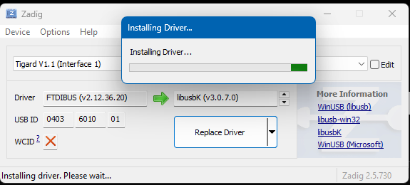

JTAG Debugging
==============

Hazard3 includes a RISC-V Debug Module and Debug Transport Module. On ECP5
boards, Hazard3 exposes the RISC-V DTM through the ECP5 chip JTAG TAP and the
``JTAGG`` primitive. OpenOCD therefore sees the physical ECP5 TAP first and then
uses the ECP5 private ER1/ER2 instructions to reach Hazard3 DTMCS and DMI.

For an explanation of the hardware path, abstract commands, instruction
injection, system-bus access, and which debug features are selected in this
bitstream, see :doc:`../architecture/hazard3/debug`.

OpenOCD and GDB
---------------

GDB connects to OpenOCD over TCP, normally ``localhost:3333``. GDB does not
open the USB JTAG adapter directly. The USB driver and adapter configuration
therefore belong to OpenOCD, while ``scripts/load-firmware.sh`` uses GDB only
after OpenOCD has successfully examined the target.

With OpenOCD already running and no other GDB client attached:

.. code-block:: bash

   ./scripts/load-firmware.sh

Or provide an explicit ELF:

.. code-block:: bash

   ./scripts/load-firmware.sh /path/to/hazard3-boot-monitor.elf

The batch loader halts the target, loads the ELF, verifies the loaded sections
with ``compare-sections``, sets ``$pc`` to ``_start``, resumes the processor,
and disconnects.

ULX3S on-board FT231X
---------------------

On ULX3S, the project uses the board's normal FT231X USB/JTAG connection. The
current ``ft232r`` OpenOCD path has been verified on Windows with **WinUSB** and
**libusbK**. WinUSB is convenient when the same FT231X is also used by the
Hazard3-Doom WebUSB FPGA flasher. The default FTDI VCP/D2XX binding is for
FTDI-native tools such as Windows ``fujprog`` and is not the libusb OpenOCD
path.

See :doc:`web-flasher` for the ULX3S driver compatibility matrix.

ULX4M-LD with Tigard
--------------------

The ULX4M Micro-B DFU connection is the FPGA configuration/bootloader path. It
is **not** the Hazard3 JTAG debug adapter. For ULX4M-LD debugging, use an
external Tigard FT2232H.

Known-good Tigard setup
~~~~~~~~~~~~~~~~~~~~~~~

Use these settings:

.. list-table::
   :header-rows: 1
   :widths: 35 65

   * - Item
     - Setting
   * - Tigard mode selector
     - ``JTAG``
   * - Tigard target power
     - ``OFF``; do not power the ULX4M from Tigard
   * - Target reference voltage
     - 3.3 V
   * - USB VID:PID
     - ``0403:6010``
   * - OpenOCD FTDI channel
     - ``1`` (FT2232H channel B / USB Interface 1)
   * - JTAG clock
     - 1000 kHz
   * - ECP5 device
     - LFE5UM-85F
   * - ECP5 IDCODE
     - ``0x01113043``
   * - Hazard3 DTMCS/DMI instructions
     - ``0x32`` / ``0x38``

The correct LFE5UM-85F IDCODE is ``0x01113043``. Do not use the
``0x41113043`` value associated with a different ECP5 device variant.

Windows driver split
~~~~~~~~~~~~~~~~~~~~

Tigard exposes two independent FT2232H USB interfaces. Configure them once and
leave them that way:

.. list-table::
   :header-rows: 1
   :widths: 25 25 25 25

   * - USB interface
     - FT2232H channel
     - Windows driver
     - Project use
   * - Interface 0
     - A
     - FTDI VCP
     - UART COM port
   * - Interface 1
     - B
     - libusbK
     - OpenOCD JTAG

This allows PuTTY/Web Serial on the UART and OpenOCD JTAG at the same time;
there is no reason to keep changing drivers between them. If libusbK is
accidentally installed on Interface 0, the UART COM port disappears. Restore
Interface 0 to the FTDI USB Serial/VCP driver and leave Interface 1 on libusbK.

   Apply libusbK to Tigard Interface 1 for JTAG. Keep Interface 0 on the FTDI
   VCP driver for the UART COM port.

ULX4M-LD UART through Tigard
~~~~~~~~~~~~~~~~~~~~~~~~~~~~

Tigard's UART interface is independent of its JTAG channel. Use 115200 8N1,
no flow control. On the Waveshare Raspberry Pi-style 40-pin header, the
confirmed wiring is:

.. code-block:: text

   Tigard UART TX (yellow)  -> physical pin 16 -> GPIO23 -> FPGA N4 -> uart_rx
   Tigard UART RX (orange)  <- physical pin 18 -> GPIO24 <- FPGA N3 <- uart_tx
   Tigard GND               -> physical pin 20
   Tigard VCC               -> not connected

TX and RX must be crossed exactly as shown.

ULX4M-LD OpenOCD configuration
~~~~~~~~~~~~~~~~~~~~~~~~~~~~~~

The project configuration is:

.. code-block:: bash

   ./bin/openocd.exe -d2 \
       -f ./third_party/Hazard3/example_soc/ulx4m-openocd-tigard.cfg

The important configuration values are equivalent to:

.. code-block:: text

   adapter driver ftdi
   ftdi vid_pid 0x0403 0x6010
   ftdi channel 1
   ftdi layout_init 0x0038 0x003b
   ftdi layout_signal nTRST -data 0x0010
   ftdi layout_signal nSRST -data 0x0020

   transport select jtag
   adapter speed 1000

   set _CHIPNAME lfe5um85
   jtag newtap $_CHIPNAME hazard3 \
       -expected-id 0x01113043 \
       -irlen 8 \
       -irmask 0xFF \
       -ircapture 0x5

   set _TARGETNAME $_CHIPNAME.hazard3
   target create $_TARGETNAME riscv -chain-position $_TARGETNAME
   riscv set_ir dtmcs 0x32
   riscv set_ir dmi 0x38

   gdb_report_data_abort enable
   init
   halt

The established Tigard wiring does **not** connect a target reset wire. Do not
rely on SRST/TRST to reset or start the ULX4M design; the FTDI layout entries
remain part of the adapter configuration, but reset is not physically wired to
the target in this setup.

A healthy session reaches output similar to:

.. code-block:: text

   JTAG tap: lfe5um85.hazard3 tap/device found: 0x01113043
   Examined RISC-V core; found 1 hart
   XLEN=32
   Listening on port 3333 for gdb connections

The known-good Hazard3 DTMCS value is ``0x00004071``.

Interpreting ``dtmcontrol is 0``
~~~~~~~~~~~~~~~~~~~~~~~~~~~~~~~~

The ECP5 hard JTAG TAP can return the chip IDCODE even when the Hazard3 user
bitstream is not running. Therefore this combination is diagnostically useful:

.. code-block:: text

   JTAG IDCODE = 0x01113043
   dtmcontrol = 0

It proves that the physical Tigard-to-ECP5 JTAG path is alive, but does **not**
prove that the Hazard3 ``JTAGG``/DTM user logic is active. Before changing the
DTM RTL or JTAG wiring, confirm that the ULX4M user bitstream has actually been
started. If the board is still in its DFU bootloader, run:

.. code-block:: bash

   ./bin/dfu-util.exe -a 0 -e

Then retry OpenOCD. In the validated bring-up sequence, leaving DFU this way
started the user design, restored the Hazard3 UART, and made the user FPGA
logic available for further testing.

If the user design is visibly running on UART but DTMCS is still zero, use the
raw ECP5 ER1/DTMCS scan or compare with a previously known-good OpenOCD build
before modifying the Hazard3 RTL.

Building and loading a clock-matched monitor
~~~~~~~~~~~~~~~~~~~~~~~~~~~~~~~~~~~~~~~~~~~~~

The current qualified ULX4M-LD FPGA profile runs Hazard3/AHB at 40 MHz. Build a
matching software-only monitor without rerouting the FPGA:

.. code-block:: bash

   HAZARD3_BUILD_DIR="$PWD/build/ulx4m-ld-40mhz/monitor" \
   HAZARD3_MEMORY_PROFILE=64m \
   HAZARD3_SYS_CLK_HZ=40000000 \
       ./scripts/build.sh

Then, with OpenOCD already examining the target:

.. code-block:: bash

   ./scripts/load-firmware.sh \
       ./build/ulx4m-ld-40mhz/monitor/hazard3-boot-monitor.elf

A successful load reports matching ``.vectors``, ``.text``, read-only data,
and ``.data`` sections before resuming from address ``0x00000040``.

VisualGDB
---------

Windows users can use the project files under ``VisualGDB/`` with Visual
Studio. The debugger still talks to the same OpenOCD/GDB target, so the
command-line path remains the reference workflow. Disconnect VisualGDB before
running the batch firmware loader, because only one GDB client should own the
OpenOCD target at a time.

The GDB startup helper is:

.. code-block:: text

   scripts/hazard3-debug.gdb

Troubleshooting
---------------

If the debug module is not detected reliably, first distinguish physical TAP
access from Hazard3 DTM access. A correct ECP5 IDCODE with DTMCS zero is a
different failure from an adapter that cannot read the ECP5 IDCODE at all.
Reduce the JTAG clock only after checking the active FPGA image, Tigard driver
split, and target power/reference settings.

See :doc:`../troubleshooting` for common OpenOCD and ownership problems.
