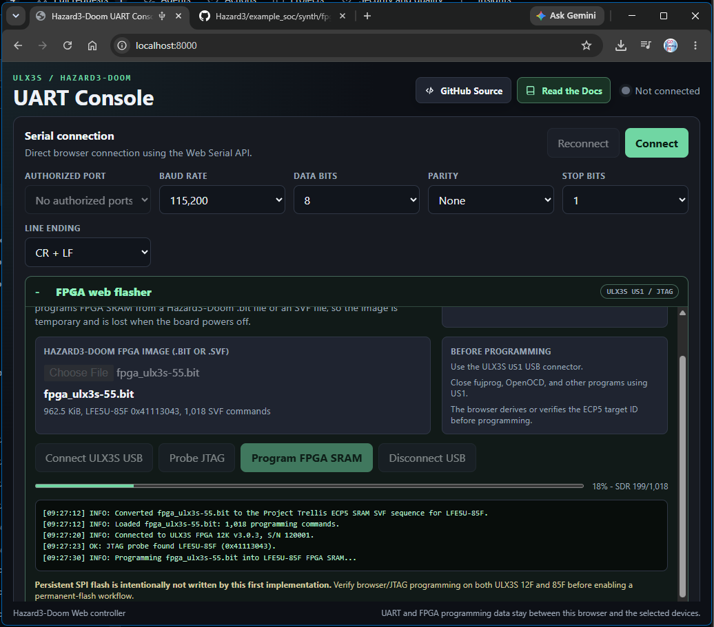
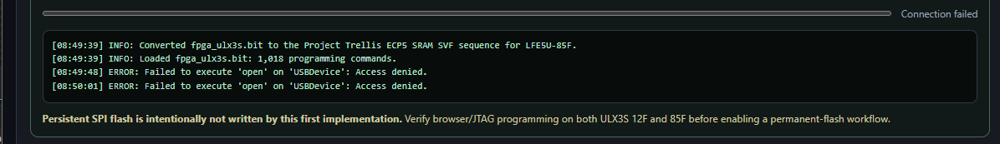
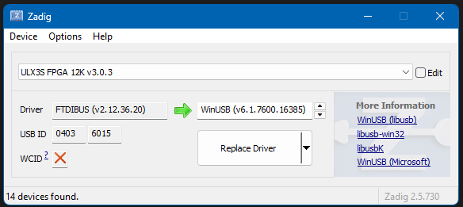
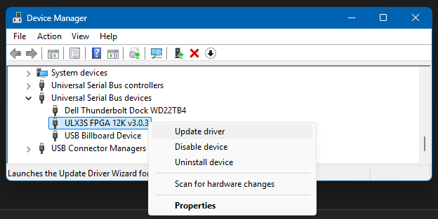

FPGA WebUSB Flasher
===================

Hazard3-Doom includes a browser-based ULX3S FPGA programmer in the ``web/``
application. It programs the ECP5 FPGA directly through the ULX3S ``US1``
FT231X JTAG interface using WebUSB.

The flasher is separate from the UART console:

.. code-block:: text

   Browser
     |
     +-- Web Serial --> UART adapter --> Hazard3 monitor / Doom console
     |
     +-- WebUSB -----> ULX3S US1 FT231X --> ECP5 JTAG --> FPGA SRAM

The current implementation programs **FPGA SRAM only**. The selected image
starts immediately after programming, but it is volatile and is lost when the
board loses power. The browser flasher does not erase or rewrite the ULX3S SPI
configuration flash.

This makes the web flasher suitable for testing a newly built Hazard3-Doom
bitstream before considering a persistent flash update.

   The FPGA web flasher uses WebUSB for ULX3S JTAG while the rest of the page
   retains the existing Web Serial console.

Requirements
------------

Use a current Chromium-based browser such as Chrome or Edge. WebUSB requires a
secure context, so serve the page through HTTPS or from ``localhost``.

For local development, start a simple server from the repository ``web/``
directory:

.. code-block:: bash

   cd web
   python3 -m http.server 8000

Then open:

.. code-block:: text

   http://localhost:8000/

The browser communicates directly with the selected USB device. FPGA image and
JTAG data are not uploaded to a web server.

Windows USB driver compatibility
--------------------------------

The ULX3S ``US1`` connector exposes the on-board FT231X used for JTAG. On
Windows, the driver bound to that FT231X determines which host-side USB tools
can open it. This is separate from the external USB-to-UART adapter used by the
Hazard3-Doom Web Serial console.

The table below records the combinations used by the current Hazard3-Doom
ULX3S workflow. ``OpenOCD`` refers to a build with the ``ft232r`` adapter driver
and a libusb Windows backend, such as the xPack build used by this project.

.. raw:: html

    <table class="compat-table">
        <thead>
            <tr>       <th>Tool / path</th>                                                               <th>WinUSB</th>                                  <th>FTDI VCP/D2XX</th>                                                             <th>libusbK</th></tr>
        </thead>
        <tbody>
            <tr><td>OpenOCD (ULX3S FT231X JTAG)</td>           <td> Works</td> <td>  No</td>                   <td> Works</td></tr>
            <tr><td>GDB through OpenOCD</td>                   <td> Works</td> <td>  No OpenOCD transport</td> <td> Works</td></tr>
            <tr><td>Hazard3-Doom WebUSB FPGA/JTAG flasher</td> <td> Works</td> <td>  No</td>                   <td>  No</td></tr>
            <tr><td>Windows fujprog / FTDI D2XX tools</td>     <td>  No</td>    <td> Works</td>                <td>  No</td></tr>
            <tr><td>Hazard3-Doom Web Serial UART (external
                    CH340/CH341, CP210x, FTDI UART, etc.)</td> <td>  N/A</td>   <td>  N/A</td>                  <td>  N/A</td></tr>
            <tr><td>PuTTY / normal COM-port UART
                    on the external adapter</td>               <td>  N/A</td>   <td>  N/A</td>                  <td>  N/A</td></tr>
        </tbody>
    </table>

For Hazard3-Doom development, **WinUSB is the most convenient ULX3S FT231X
binding when both browser WebUSB programming and OpenOCD/GDB are needed**. The
current OpenOCD ``ft232r`` path has been verified working with WinUSB; libusbK
continues to be a valid OpenOCD option, but it is not suitable for the browser
WebUSB flasher.

The normal FTDI VCP/D2XX driver is still required by Windows ``fujprog`` and
other applications that use the FTDI proprietary driver/API directly. Changing
the FT231X binding does not reset the already configured FPGA.

A typical WebUSB driver mismatch is:

.. code-block:: text

   ERROR: Failed to execute 'open' on 'USBDevice': Access denied.

The flasher recognizes the Windows access-denied case and logs a WinUSB driver
hint rather than treating it as a JTAG failure.

   ``USBDevice.open()`` access denied occurs before JTAG begins. On Windows,
   verify the FT231X driver binding before investigating FPGA or JTAG wiring.

One way to select WinUSB is with Zadig:

#. Connect the ULX3S ``US1`` USB connector.
#. Close ``fujprog``, OpenOCD, ``openFPGALoader``, and other programs that may
   already own the FT231X.
#. Start Zadig and enable **Options -> List All Devices** if necessary.
#. Select the ULX3S FTDI device. Confirm that the selected device is the intended
   ULX3S interface before replacing any driver.
#. Select **WinUSB** as the replacement driver and install it.
#. Unplug and reconnect ``US1`` before returning to the browser.

   Example Zadig selection for an ULX3S FT231X. Verify the selected device
   before replacing its driver.

.. warning::

   Rebinding the FT231X changes which Windows USB API can claim the interface.
   Software that specifically expects FTDI VCP/D2XX will stop working on that
   interface until the FTDI driver is restored. This does **not** prevent the
   separate external USB-to-UART adapter from continuing to provide the
   Hazard3-Doom Web Serial console.

To return ``US1`` to the normal FTDI driver, use Windows Device Manager to
update the ULX3S USB device driver back to the installed FTDI driver, or
reinstall the appropriate FTDI VCP/D2XX package.

   Device Manager can be used to restore the normal FTDI driver when an FTDI
   VCP/D2XX application such as Windows ``fujprog`` is required.

Programming a ``.bit`` file
---------------------------

The normal Hazard3-Doom flow accepts the ECP5 ``.bit`` file produced by the FPGA
build directly. No manual conversion step is required.

For the standard ULX3S build, the image is typically:

.. code-block:: text

   build/fpga_ulx3s.bit

To program it:

#. Build or obtain the bitstream for the intended ULX3S FPGA variant.
#. Open the Hazard3-Doom web application and expand **FPGA web flasher**.
#. Select the ``.bit`` file.
#. Click **Connect ULX3S USB** and select the ULX3S FTDI device connected to
   ``US1``.
#. Click **Probe JTAG**.
#. Confirm that the detected ECP5 device is the expected FPGA.
#. Click **Program FPGA SRAM**.
#. Wait for the progress indicator and flasher log to report successful
   completion.

A successful 85F session contains messages similar to:

.. code-block:: text

   INFO: Converted fpga_ulx3s.bit to the Project Trellis ECP5 SRAM SVF sequence for LFE5U-85F.
   INFO: Loaded fpga_ulx3s.bit: 1,018 programming commands.
   INFO: Connected to ULX3S FPGA ...
   OK: JTAG probe found LFE5U-85F (0x41113043).
   INFO: Programming fpga_ulx3s.bit into LFE5U-85F FPGA SRAM...
   OK: Programming stream completed successfully in ... s (1,018 commands).

After successful SRAM configuration, the newly programmed FPGA image starts
immediately. If the image contains the normal Hazard3-Doom system, the resident
monitor and Doom workflow can then continue normally.

Target identification and safety checks
---------------------------------------

The browser probes the physical ECP5 JTAG ID before programming. The current
flasher recognizes:

.. list-table::
   :header-rows: 1
   :widths: 35 35

   * - FPGA
     - JTAG IDCODE
   * - LFE5U-12F
     - ``0x21111043``
   * - LFE5U-25F
     - ``0x41111043``
   * - LFE5U-45F
     - ``0x41112043``
   * - LFE5U-85F
     - ``0x41113043``

For a ``.bit`` file, the browser also extracts the ECP5 target ID embedded in
the bitstream. Immediately before programming it probes the board again and
refuses to continue if the bitstream target and physical FPGA do not match.

This check is deliberately based on the ECP5 JTAG ID rather than the FT231X USB
product string. An FT231X EEPROM description can identify the board as, for
example, ``ULX3S FPGA 12K`` even when the physical ECP5 JTAG ID reports an 85F.
For programming decisions, the JTAG ID is authoritative.

How ``.bit`` programming works
------------------------------

Project Trellis normally provides ``tools/bit_to_svf.py`` to convert an ECP5
bitstream into the JTAG Serial Vector Format (SVF) sequence needed for SRAM
configuration. Hazard3-Doom performs this conversion in the browser so users can
select the build output directly.

The browser-side conversion includes:

* extraction of the ECP5 IDCODE from the bitstream;
* the Project Trellis ECP5 configuration setup sequence;
* bit reversal required by the SVF/JTAG representation;
* 8000-bit maximum ``SDR`` programming chunks;
* ECP5 status and verification operations; and
* the final sequence that starts the configured FPGA image.

The generated stream is then executed by the browser's JTAG state machine over
the FT231X synchronous bit-bang interface.

Pre-generated SVF files
-----------------------

The flasher also accepts an ``.svf`` file. This is useful for testing,
interoperability, or comparing browser behavior with other JTAG tools.

Project Trellis can generate an equivalent ECP5 SRAM programming stream with:

.. code-block:: bash

   python3 /path/to/prjtrellis/tools/bit_to_svf.py \
       build/fpga_ulx3s.bit \
       build/fpga_ulx3s.svf

The browser implements the SVF operations required by the normal Project
Trellis ECP5 SRAM programming sequence. Unsupported commands stop programming
with an explicit error instead of being silently ignored.

JTAG transport
--------------

The WebUSB programmer follows the ULX3S FT231X synchronous bit-bang mapping used
by ``fujprog``:

.. code-block:: text

   TCK  0x20
   TMS  0x40
   TDI  0x80
   TDO  0x08

The transport uses FT231X synchronous bit-bang mode. The implementation accounts
for the FTDI receive pipeline when sampling TDO; this is important because a
one-cycle sampling error shifts the returned ECP5 IDCODE.

The browser also enforces SVF ``TDO``/``MASK`` comparisons while programming.
A comparison failure stops the stream and is reported in the flasher log.

Flasher log controls
--------------------

The FPGA flasher has its own log, independent of the UART terminal.

* **Auto-scroll** follows new programming messages by default. Clear the option
  to inspect earlier output while programming continues.
* **Copy log** copies the complete current flasher log to the clipboard.
* **Clear log** removes the displayed flasher history without disconnecting USB,
  resetting progress, or interrupting an active JTAG programming operation.
* The log area has a vertical scrollbar and can be resized vertically.

Troubleshooting
---------------

``USBDevice.open(): Access denied``
~~~~~~~~~~~~~~~~~~~~~~~~~~~~~~~~~~~

On Windows, this normally means the FT231X is still using the FTDI VCP/D2XX
driver instead of WinUSB, or another process already owns the USB interface.
Install/select WinUSB for the intended ULX3S FT231X, unplug/replug ``US1``, and
retry. If WinUSB is already installed, close other USB/JTAG programs first.

See :ref:`webusb-access-denied` for the condensed troubleshooting procedure.

Unrecognized or shifted JTAG ID
~~~~~~~~~~~~~~~~~~~~~~~~~~~~~~~

A healthy probe should return one of the known ECP5 IDCODEs in the table above.
If the returned value is not recognized:

* disconnect other JTAG software;
* unplug/reconnect ``US1``;
* reconnect the browser and probe again; and
* confirm that the current ``web/flasher.js`` is being served rather than a
  stale browser-cached copy.

Do not program an image when the physical JTAG target cannot be identified.

Bitstream target mismatch
~~~~~~~~~~~~~~~~~~~~~~~~~

If the browser reports that the board and image target different ECP5 devices,
do not bypass the check. Rebuild or select the bitstream intended for the
physical board.

Programming completes and the new image starts
~~~~~~~~~~~~~~~~~~~~~~~~~~~~~~~~~~~~~~~~~~~~~~

This is the expected result. FPGA SRAM programming is volatile, so a power cycle
returns the FPGA to whatever configuration is stored in persistent SPI flash.

Persistent configuration
------------------------

The WebUSB flasher intentionally does **not** write persistent SPI flash. A
persistent update has a greater recovery cost than a temporary SRAM load and
should remain a separate, explicitly confirmed workflow.

See :doc:`../getting-started/programming` for the distinction between temporary
FPGA loading and persistent boot configuration.

Implementation references
-------------------------

* `ULX3S manual <https://github.com/emard/ulx3s/blob/master/doc/MANUAL.md>`_
* `fujprog <https://github.com/kost/fujprog>`_
* `Project Trellis <https://github.com/YosysHQ/prjtrellis>`_
* `WebUSB API <https://developer.mozilla.org/en-US/docs/Web/API/WebUSB_API>`_
